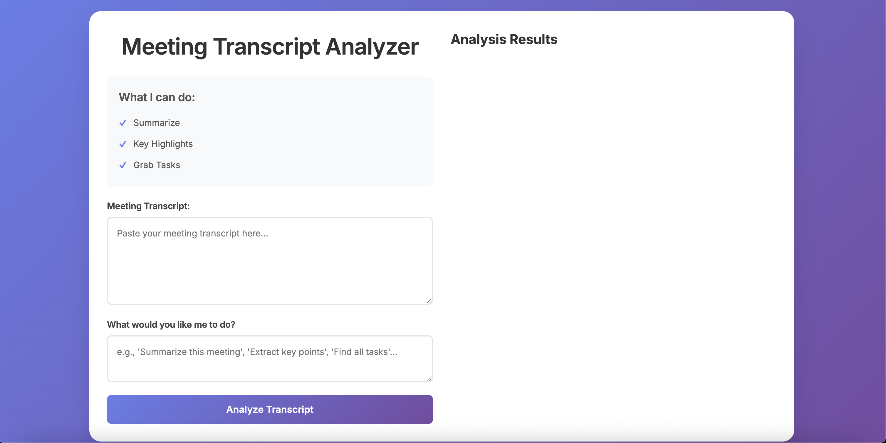

# Meeting Transcript Analyzer - Multi-Agent MCP App

A multi-agent system that analyzes meeting transcripts using AI-powered summarization, key point extraction, and task identification. **Fully compliant with the Model Context Protocol (MCP) standard.**

## Features

- **Summarize**: Generate concise summaries of meeting transcripts (see [screenshots](#application-screenshots))
- **Key Highlights**: Extract and display key points as bullet points (•) (see [screenshots](#application-screenshots))
- **Grab Tasks**: Identify actionable tasks from meeting discussions (see [screenshots](#application-screenshots))
- **Modern Web UI**: Clean, responsive horizontal layout interface for easy interaction
- **MCP Compliant**: Full adherence to Model Context Protocol standards

## MCP Compliance

This application is fully compliant with the **Model Context Protocol (MCP)** standard:

### ✅ MCP Standard Implementation

- **Discovery Endpoint**: `/.well-known/mcp.json` (MCP compliant)
- **Tool Schema**: JSON Schema format with `inputSchema` property
- **Response Format**: MCP-compliant `content` array with structured content
- **Request Format**: Standard MCP `invoke` endpoint with `name` and `arguments`
- **Capabilities**: Proper capabilities object in discovery response

### 🔧 MCP Endpoints

Each agent exposes MCP-compliant endpoints:

```
GET  /.well-known/mcp.json     # Tool discovery (MCP standard)
POST /invoke                   # Tool invocation (MCP standard)
GET  /health                   # Health check
```

### 📋 MCP Tool Definitions

**Summarizer Agent Tools:**
- `summarize_transcript`: Generates concise meeting summaries
- `highlight_key_points`: Extracts 3-5 key insights as bullet points

**Task Extractor Agent Tools:**
- `extract_tasks`: Identifies actionable tasks from transcripts

### 🔄 MCP Response Format

All tools return MCP-compliant responses:

```json
{
  "content": [
    {
      "type": "text",
      "text": "Tool output content here..."
    }
  ]
}
```

## Prerequisites

- Python 3.9+
- OpenAI API key

## Setup

1. **Install dependencies:**

   ```bash
   pip install -r requirements.txt
   ```

2. **Configure OpenAI API Key:**
   Create a file named `openai_key.txt` in the project root and add your OpenAI API key:
   ```
   sk-your-openai-api-key-here
   ```

## Running the Agents

**Important:** All commands must be run from the project root directory.

**Note:** Start the sub-agents first, then the super agent to ensure proper tool registration.

### 1. Start the Summarizer Agent (Port 8001)

```bash
python3 -m uvicorn agents.summarizer_agent:summarizer_app --reload --port 8001
```

### 2. Start the Task Extractor Agent (Port 8002)

```bash
python3 -m uvicorn agents.task_extractor_agent:task_app --reload --port 8002
```

### 3. Start the Super Agent (Port 8000)

```bash
python3 -m uvicorn agents.super_agent:super_app --reload --port 8000
```

## Using the Application

1. **Access the Web Interface:**
   Open your browser and go to: [http://localhost:8000](http://localhost:8000)

2. **Analyze a Transcript:**
   - Paste your meeting transcript in the left textarea
   - Enter a prompt like "Summarize this meeting" or "Extract key points" in the second textarea
   - Click "Analyze Transcript"

3. **View Results:**
   - Results appear in the right panel with structured formatting
   - Summaries appear as formatted paragraphs
   - Key points display as clean bullet points (•)
   - Tasks show as numbered actionable items
   - Metadata shows transcript length, tool used, and point/task counts

## Application Screenshots

### Welcome Page


_The clean, modern interface users see when first opening the application._

### Summarize Flow


_The application summarizing a meeting transcript with a brief, concise style._

### Key Highlights Flow


_Extracting key insights and main points from a meeting transcript as bullet points._

### Task Extraction Flow


_Identifying and extracting actionable tasks from meeting discussions._

## Architecture

- **Super Agent (Port 8000)**: Main entry point that serves the web UI and orchestrates sub-agents
- **Summarizer Agent (Port 8001)**: Handles transcript summarization and key point extraction
- **Task Extractor Agent (Port 8002)**: Identifies and extracts actionable tasks from transcripts

## Technical Details

- **Backend Formatting**: All response formatting is handled by the super agent for consistent UI presentation
- **Structured Responses**: Responses include type, title, content, and metadata fields
- **MCP Protocol**: Uses Model Context Protocol for agent communication
- **Responsive Design**: UI adapts to mobile devices with vertical stacking

## API Endpoints

- **Super Agent**: `http://localhost:8000/` (Web UI) and `/ask` (API)
- **Summarizer Agent**: `http://localhost:8001/docs` (API docs)
- **Task Extractor Agent**: `http://localhost:8002/docs` (API docs)

## MCP Integration

### For MCP Clients

To integrate with MCP-compliant clients:

1. **Discover Tools:**
   ```bash
   curl http://localhost:8001/.well-known/mcp.json
   curl http://localhost:8002/.well-known/mcp.json
   ```

2. **Invoke Tools:**
   ```bash
   curl -X POST http://localhost:8001/invoke \
     -H "Content-Type: application/json" \
     -d '{"name": "summarize_transcript", "arguments": {"transcript": "Your transcript here..."}}'
   ```

### MCP Client Libraries

This application works with any MCP-compliant client library:
- [MCP Python SDK](https://github.com/modelcontextprotocol/python-sdk)
- [MCP JavaScript SDK](https://github.com/modelcontextprotocol/js-sdk)
- [MCP Go SDK](https://github.com/modelcontextprotocol/go-sdk)

## Troubleshooting

- **"ModuleNotFoundError: No module named 'agents'"**: Make sure you're running commands from the project root directory
- **"uvicorn: command not found"**: Use `python3 -m uvicorn` instead of just `uvicorn`
- **API Key Issues**: Ensure `openai_key.txt` exists and contains a valid OpenAI API key
- **Port Conflicts**: Make sure ports 8000, 8001, and 8002 are available
- **MCP Discovery Issues**: Verify agents are running and accessible at their respective ports

## Development

### Code Formatting

To maintain consistent code style, use the provided formatting script:

```bash
python3 format_code.py
```

This will format all Python files with Black and HTML/Markdown files with Prettier.

### Manual Formatting

You can also format files individually:

```bash
# Format Python files
python3 -m black agents/ --line-length=88

# Format HTML and Markdown files
prettier --write index.html README.md
```

## File Structure

```
mcps/
├── agents/
│   ├── __init__.py
│   ├── summarizer_agent.py      # MCP-compliant summarizer
│   ├── task_extractor_agent.py  # MCP-compliant task extractor
│   ├── super_agent.py           # MCP-compliant orchestrator
│   ├── models.py
│   ├── config.py
│   └── utils.py
├── docs/
│   └── images/
│       ├── welcome-page.png
│       ├── summarize-flow.png
│       ├── key-highlights-flow.png
│       └── task-extraction-flow.png
├── index.html
├── requirements.txt
├── README.md
├── format_code.py
└── openai_key.txt (create this file)
```
